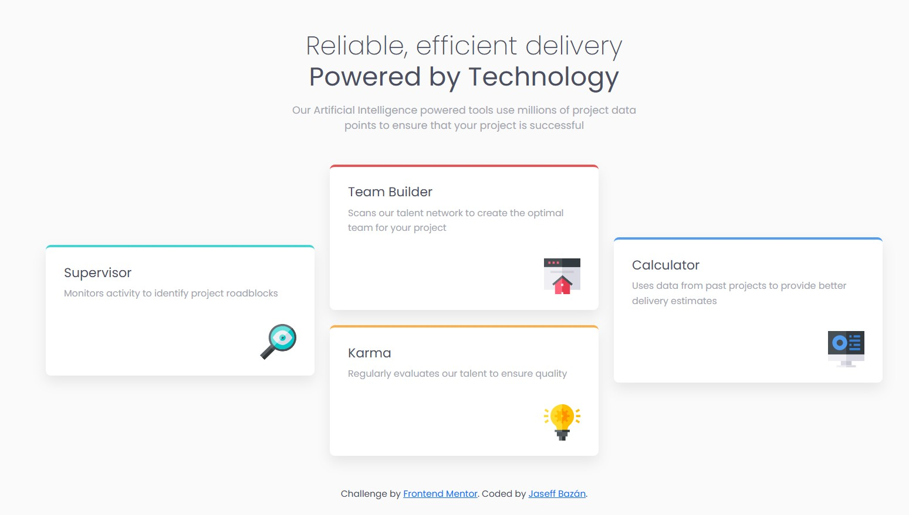

# Frontend Mentor - Four card feature section solution

This is a solution to the [Four card feature section challenge on Frontend Mentor](https://www.frontendmentor.io/challenges/four-card-feature-section-weK1eFYK). Frontend Mentor challenges help you improve your coding skills by building realistic projects.

---

## Table of contents

- [Overview](#overview)
  - [The challenge](#the-challenge)
  - [Screenshot](#screenshot)
  - [Links](#links)
- [My process](#my-process)
  - [Built with](#built-with)
  - [What I learned](#what-i-learned)
  - [Continued development](#continued-development)
  - [Useful resources](#useful-resources)
- [Author](#author)

---

## Overview

### The challenge

Users should be able to:

- View the optimal layout depending on their device's screen size
- Experience a clean, accessible, and responsive card-based layout
- Clearly understand the hierarchy and purpose of each feature card

### Screenshot

> Screenshots were taken from the final responsive implementation and reflect both desktop and mobile layouts.

### Links

- Solution URL: https://github.com/jaseff2805/FrontEndMentor_FrontEndMentor_FourCardFeatureSection_Jaseff2805
- Live Site URL: https://jaseff2805.github.io/FrontEndMentor_FrontEndMentor_FourCardFeatureSection_Jaseff2805/

---

## My process

### Built with

- Semantic HTML5
- Bootstrap 5 (Grid, spacing, responsive utilities)
- Minimal custom CSS
- CSS custom properties (variables)
- Mobile-first workflow
- Accessibility best practices

### What I learned

This project reinforced the importance of **using a framework like Bootstrap correctly**, focusing on layout and responsiveness while keeping custom CSS minimal and intentional.

Key learnings include:

- How to structure responsive layouts using Bootstrap’s grid system without overcomplicating the markup
- How to combine semantic HTML elements (`main`, `section`, `article`, `header`) with Bootstrap classes
- How to use CSS variables to centralize design tokens such as colors, shadows, and border radius
- How to handle decorative images properly using `aria-hidden` and empty `alt` attributes

Overall, this challenge helped me improve my ability to translate static designs into clean, scalable, and maintainable front-end code.

### Continued development

In future projects, I want to:

- Reduce custom CSS even further by leveraging more of Bootstrap’s utility classes
- Improve accessibility by incorporating automated audits (Lighthouse, axe)
- Practice more complex responsive layouts using CSS Grid combined with Bootstrap
- Focus on writing even more maintainable and reusable component-based CSS

### Useful resources

- [Bootstrap Documentation](https://getbootstrap.com/docs/5.3/getting-started/introduction/) – Essential for understanding grid behavior and responsive utilities
- [MDN Web Docs – Semantic HTML](https://developer.mozilla.org/en-US/docs/Glossary/Semantics) – Helped reinforce proper semantic structure
- [Frontend Mentor Community](https://www.frontendmentor.io/community) – Great for feedback and learning from other solutions

---

## Author

- Frontend Mentor – [@jaseff2805](https://www.frontendmentor.io/profile/jaseff2805)
- GitHub – [jaseff2805](https://github.com/jaseff2805)

